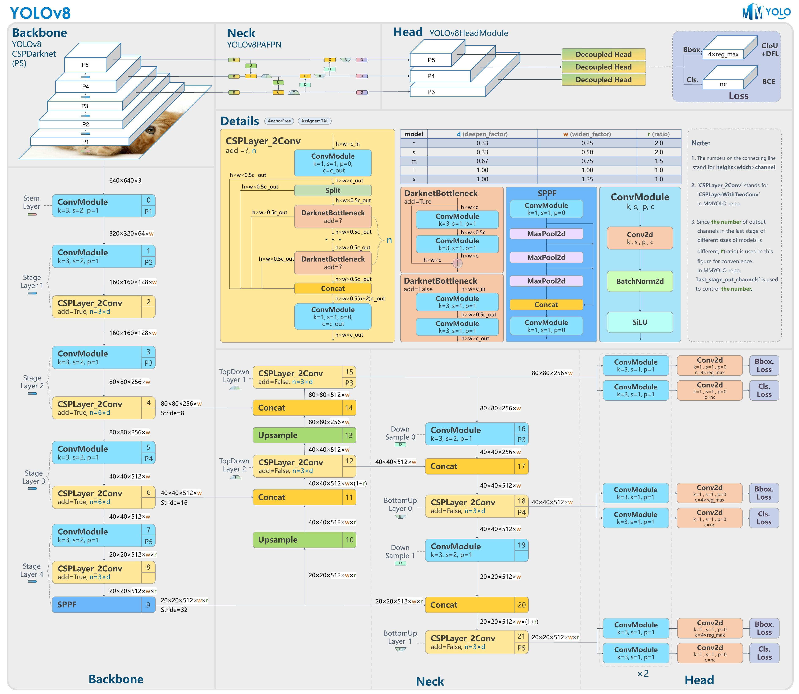

# 白血球图像分割系统： yolov8-seg-repvit

### 1.研究背景与意义

[参考博客](https://gitee.com/YOLOv8_YOLOv11_Segmentation_Studio/projects)

[博客来源](https://kdocs.cn/l/cszuIiCKVNis)

研究背景与意义

白血球作为人体免疫系统的重要组成部分，其种类和数量的变化常常反映出个体健康状况的变化。随着医学影像技术的快速发展，基于图像处理的白血球分类与分割技术逐渐成为临床诊断和疾病监测的重要工具。传统的白血球分类方法多依赖于人工观察，不仅耗时耗力，而且容易受到主观因素的影响，导致分类结果的不一致性。因此，开发一种高效、准确的自动化白血球图像分割系统显得尤为重要。

近年来，深度学习技术在计算机视觉领域取得了显著的进展，尤其是目标检测和图像分割任务中。YOLO（You Only Look Once）系列模型因其高效的实时处理能力和优越的检测精度而受到广泛关注。YOLOv8作为该系列的最新版本，结合了多种先进的技术，能够在复杂背景下实现高精度的目标检测和分割。通过对YOLOv8进行改进，针对白血球图像的特征进行优化，能够有效提升模型在白血球实例分割任务中的表现。

本研究基于一个包含1100幅白血球图像的数据集，涵盖了五种主要的白血球类型：嗜碱性粒细胞、嗜酸性粒细胞、淋巴细胞、单核细胞和中性粒细胞。这一数据集为模型的训练和验证提供了丰富的样本，能够有效提高模型的泛化能力和分类准确性。通过对不同类型白血球的实例分割，不仅可以实现自动化的白血球计数，还可以为临床医生提供更为详尽的细胞形态学分析，辅助疾病的早期诊断和治疗。

在医学研究中，白血球的分类与计数对于各种疾病的诊断具有重要意义。例如，淋巴细胞的增多可能与某些病毒感染有关，而嗜酸性粒细胞的升高则可能提示过敏反应或寄生虫感染。通过准确的白血球分割与分类，能够为临床医生提供更为可靠的依据，从而提高疾病诊断的准确性和及时性。此外，基于改进YOLOv8的白血球图像分割系统还具有广泛的应用前景，可以推广至其他类型细胞的自动化分析，推动细胞生物学和医学影像学的发展。

综上所述，基于改进YOLOv8的白血球图像分割系统的研究，不仅具有重要的理论意义，也具备广泛的应用价值。通过提高白血球分类的自动化水平，能够有效减轻临床工作负担，提高诊断效率，为个体化医疗和精准医学的发展提供有力支持。这一研究将为未来的医学影像分析技术奠定基础，推动人工智能在医疗领域的深入应用。

### 2.图片演示


注意：本项目提供完整的训练源码数据集和训练教程,由于此博客编辑较早,暂不提供权重文件（best.pt）,需要按照6.训练教程进行训练后实现上图效果。

### 3.视频演示

[3.1 视频演示](https://www.bilibili.com/video/BV1W8UoY8EkF/)

### 4.数据集信息

##### 4.1 数据集类别数＆类别名

nc: 5
names: ['Basophil', 'Eosinophil', 'Lymphocyte', 'Monocyte', 'Neutrophil']


##### 4.2 数据集信息简介

数据集信息展示

在本研究中，我们采用了名为“White Blood Cell”的数据集，以训练和改进YOLOv8-seg模型，旨在实现白血球图像的高效分割。该数据集专注于五种主要类型的白血球，涵盖了生物医学领域中至关重要的细胞类型。这五种细胞分别是：嗜碱性粒细胞（Basophil）、嗜酸性粒细胞（Eosinophil）、淋巴细胞（Lymphocyte）、单核细胞（Monocyte）和中性粒细胞（Neutrophil）。这些细胞在免疫反应、炎症和各种疾病的诊断中扮演着重要角色，因此对其进行准确的图像分割具有重要的临床意义。

数据集的构建过程包括从多种来源收集大量的白血球图像，并经过严格的标注，以确保每种细胞类型的准确性和一致性。每张图像都经过专业的生物医学专家审核，确保其在显微镜下的表现能够真实反映细胞的形态特征。数据集中包含的图像具有多样性，涵盖了不同的染色方法、拍摄条件和细胞状态，这为模型的训练提供了丰富的样本，有助于提高其泛化能力。

在数据集的类别方面，五种白血球类型的选择不仅反映了其在免疫系统中的功能多样性，也为模型的训练提供了多维度的挑战。嗜碱性粒细胞通常在过敏反应和寄生虫感染中增多，而嗜酸性粒细胞则与过敏和哮喘等疾病密切相关。淋巴细胞是适应性免疫反应的核心，单核细胞在炎症反应中发挥重要作用，而中性粒细胞则是机体对抗细菌感染的第一道防线。这些细胞的不同功能和形态特征，使得模型在分割时需要具备更高的敏感性和准确性。

在训练过程中，我们采用了数据增强技术，以增加数据集的多样性并提高模型的鲁棒性。这些技术包括旋转、缩放、翻转和颜色变换等，旨在模拟不同的拍摄条件和细胞状态，从而使模型能够更好地适应实际应用场景。此外，我们还对数据集进行了划分，确保训练集、验证集和测试集的合理比例，以便在模型训练和评估过程中获得可靠的性能指标。

通过对“White Blood Cell”数据集的深入分析和应用，我们期望能够显著提升YOLOv8-seg模型在白血球图像分割任务中的表现。这不仅将推动相关领域的研究进展，也将为临床诊断提供更为精准的工具，助力医学影像分析的智能化发展。总之，该数据集不仅是本研究的基础，更是实现高效、准确的白血球图像分割系统的重要支撑。


### 5.项目依赖环境部署教程（零基础手把手教学）

[5.1 环境部署教程链接（零基础手把手教学）](https://www.bilibili.com/video/BV1jG4Ve4E9t/?vd_source=bc9aec86d164b67a7004b996143742dc)


[5.2 安装Python虚拟环境创建和依赖库安装视频教程链接（零基础手把手教学）](https://www.bilibili.com/video/BV1nA4VeYEze/?vd_source=bc9aec86d164b67a7004b996143742dc)

### 6.手把手YOLOV8-seg训练视频教程（零基础手把手教学）

[6.1 手把手YOLOV8-seg训练视频教程（零基础小白有手就能学会）](https://www.bilibili.com/video/BV1cA4VeYETe/?vd_source=bc9aec86d164b67a7004b996143742dc)


按照上面的训练视频教程链接加载项目提供的数据集，运行train.py即可开始训练



     Epoch   gpu_mem       box       obj       cls    labels  img_size
     1/200     0G   0.01576   0.01955  0.007536        22      1280: 100%|██████████| 849/849 [14:42<00:00,  1.04s/it]
               Class     Images     Labels          P          R     mAP@.5 mAP@.5:.95: 100%|██████████| 213/213 [01:14<00:00,  2.87it/s]
                 all       3395      17314      0.994      0.957      0.0957      0.0843

     Epoch   gpu_mem       box       obj       cls    labels  img_size
     2/200     0G   0.01578   0.01923  0.007006        22      1280: 100%|██████████| 849/849 [14:44<00:00,  1.04s/it]
               Class     Images     Labels          P          R     mAP@.5 mAP@.5:.95: 100%|██████████| 213/213 [01:12<00:00,  2.95it/s]
                 all       3395      17314      0.996      0.956      0.0957      0.0845

     Epoch   gpu_mem       box       obj       cls    labels  img_size
     3/200     0G   0.01561    0.0191  0.006895        27      1280: 100%|██████████| 849/849 [10:56<00:00,  1.29it/s]
               Class     Images     Labels          P          R     mAP@.5 mAP@.5:.95: 100%|███████   | 187/213 [00:52<00:00,  4.04it/s]
                 all       3395      17314      0.996      0.957      0.0957      0.0845


### 7.50+种全套YOLOV8-seg创新点加载调参实验视频教程（一键加载写好的改进模型的配置文件）

[7.1 50+种全套YOLOV8-seg创新点加载调参实验视频教程（一键加载写好的改进模型的配置文件）](https://www.bilibili.com/video/BV1Hw4VePEXv/?vd_source=bc9aec86d164b67a7004b996143742dc)

### YOLOV8-seg算法简介

原始YOLOV8-seg算法原理

YOLOv8-seg算法作为YOLO系列的最新版本，进一步扩展了目标检测的能力，特别是在图像分割任务中的应用。其核心思想在于将目标检测与语义分割相结合，使得模型不仅能够识别目标物体的位置，还能精确地分割出物体的轮廓。这一进步使得YOLOv8-seg在复杂场景下的应用潜力大幅提升，尤其是在自动驾驶、医学影像分析和视频监控等领域。

YOLOv8-seg的架构依然遵循YOLO系列一贯的设计理念，分为输入层、主干网络、颈部网络和头部网络。输入层负责对输入图像进行预处理，包括缩放和归一化，以满足模型的输入要求。主干网络采用了CSPDarknet结构，结合了跨级结构（Cross Stage Partial, CSP）的设计思想，旨在通过有效的特征提取来增强模型的表现。具体而言，主干网络通过多个卷积层和批归一化层对输入图像进行下采样，以提取丰富的特征信息。

在YOLOv8-seg中，特征提取过程引入了C2f模块，这一模块通过分支结构增强了特征图的表达能力。C2f模块将输入特征图分为两个分支，分别经过卷积操作后再进行融合，这种设计不仅提高了模型的梯度流动性，还增强了特征的多样性和丰富性。此外，SPPF（快速空间金字塔池化）模块的引入，使得模型能够有效处理多尺度特征，从而提升了对不同大小目标的检测能力。

颈部网络则利用特征金字塔网络（FPN）和路径聚合网络（PAN）结构，进一步融合来自不同尺度的特征图信息。这一过程不仅提升了特征的语义信息，还增强了模型对复杂场景的适应能力。通过多层次的特征融合，YOLOv8-seg能够在目标检测和分割任务中实现更高的准确率和鲁棒性。

在头部网络的设计上，YOLOv8-seg采用了解耦的检测头结构，通过两个并行的卷积分支分别计算目标的回归和分类损失。这种设计不仅提高了模型的计算效率，还增强了对目标的检测精度。此外，YOLOv8-seg在损失函数的设计上进行了创新，采用了变焦损失来计算分类损失，同时结合数据平均保真度损失和完美交并比损失来优化边界框的回归。这种新的损失策略使得模型在训练过程中能够更好地适应复杂的目标分布，从而提高了检测和分割的准确性。

值得注意的是，YOLOv8-seg在实现目标分割时，采用了一种无锚框（Anchor-Free）的检测方式。这一方式直接预测目标的中心点和宽高比，减少了对锚框的依赖，进而提高了检测速度和准确度。这种创新的设计理念使得YOLOv8-seg在实时性要求较高的应用场景中表现尤为出色。

在实际应用中，YOLOv8-seg的表现得到了广泛的认可。通过在自制数据集上的实验，研究人员验证了该算法在目标检测和分割任务中的有效性。实验结果表明，YOLOv8-seg在处理复杂场景时，能够有效地分离和识别不同的目标，且分割效果优于许多传统的目标检测和分割算法。这一成果不仅为YOLO系列模型的进一步发展奠定了基础，也为计算机视觉领域的研究提供了新的思路。

综上所述，YOLOv8-seg算法通过对主干网络、颈部网络和头部网络的优化设计，以及创新的损失策略和无锚框检测方式，成功地将目标检测与图像分割相结合，展现了出色的性能和广泛的应用潜力。随着技术的不断进步，YOLOv8-seg有望在更多实际场景中发挥重要作用，推动计算机视觉技术的进一步发展。



### 9.系统功能展示（检测对象为举例，实际内容以本项目数据集为准）

图9.1.系统支持检测结果表格显示

  图9.2.系统支持置信度和IOU阈值手动调节

  图9.3.系统支持自定义加载权重文件best.pt(需要你通过步骤5中训练获得)

  图9.4.系统支持摄像头实时识别

  图9.5.系统支持图片识别

  图9.6.系统支持视频识别

  图9.7.系统支持识别结果文件自动保存

  图9.8.系统支持Excel导出检测结果数据


### 10.50+种全套YOLOV8-seg创新点原理讲解（非科班也可以轻松写刊发刊，V11版本正在科研待更新）

#### 10.1 由于篇幅限制，每个创新点的具体原理讲解就不一一展开，具体见下列网址中的创新点对应子项目的技术原理博客网址【Blog】：


[10.1 50+种全套YOLOV8-seg创新点原理讲解链接](https://gitee.com/qunmasj/good)

#### 10.2 部分改进模块原理讲解(完整的改进原理见上图和技术博客链接)【如果此小节的图加载失败可以通过CSDN或者Github搜索该博客的标题访问原始博客，原始博客图片显示正常】
### YOLOv8简介

YOLOv8 是 Ultralytics 公司继 YOLOv5 算法之后开发的下一代算法模型，目前支持图像分类、物体检测和实例分割任务。YOLOv8 是一个 SOTA 模型，它建立在之前YOLO 系列模型的成功基础上，并引入了新的功能和改进，以进一步提升性能和灵活性。具体创新包括：一个新的骨干网络、一个新的 Ancher-Free 检测头和一个新的损失函数，可以在从 CPU 到 GPU 的各种硬件平台上运行。注意到ultralytics 并没有直接将开源库命名为 YOLOv8，而是直接使用 Ultralytics这个单词，原因是Ultralytics这个库的定位是算法框架，而非特指某一个特定算法，其希望这个库不仅仅能够用于 YOLO 系列模型，同时也能支持其他的视觉任务如图像分类、实例分割等。下图画图YOLOv8目标检测算法同其他YOLO系列算法（YOLOv5、6、7）的实验对比图，左边是模型参数量对比，右边是速度对比。


下面两个表分别是YOLOv8和YOLOv5（v7.0版本）官方在 COCO Val 2017 数据集上测试结果，从中看出 YOLOv8 相比 YOLOv5 精度提升大，但是 N/S/M 模型相应的参数量、FLOPS等提高了不少。


#### YOLOv8概述
提供了一个全新的SOTA模型，和YOLOv5一样，基于缩放系数也提供了 N/S/M/L/X 尺度的不同大小模型，用于满足不同场景需求，同时支持图像分类、目标检测、实例分割和姿态检测任务
在骨干网络和Neck部分将YOLOv5的C3结构换成了梯度流更丰富的 C2f 结构，并对不同尺度模型调整了不同的通道数，大幅提升了模型性能；需要注意的是C2f 模块中存在Split等操作对特定硬件部署没有之前那么友好


Head部分换成了目前主流的解耦头结构，将分类和检测头分离，同时也从 Anchor-Based换成了Anchor-Free Loss
计算方面采用了 TaskAlignedAssigner 正样本分配策略，并引入了 Distribution Focal Loss
下图画出YOLOv8目标检测算法的整体结构图


#### YOLOv8模型
YOLOv8目标检测算法的模型配置文件如下：


从配置文件可以看出，YOLOv8与YOLOv5模型最明显的差异是使用C2F模块替换了原来的C3模块，两个模块的结构图下图所示。


另外Head 部分变化最大，从原先的耦合头变成了解耦头，并且从 YOLOv5 的 Anchor-Based 变成了 Anchor-Free。其结构对比图如下所示：

### RepViT简介

近年来，与轻量级卷积神经网络(cnn)相比，轻量级视觉变压器(ViTs)在资源受限的移动设备上表现出了更高的性能和更低的延迟。这种改进通常归功于多头自注意模块，它使模型能够学习全局表示。然而，轻量级vit和轻量级cnn之间的架构差异还没有得到充分的研究。在这项研究中，我们重新审视了轻量级cnn的高效设计，并强调了它们在移动设备上的潜力。通过集成轻量级vit的高效架构选择，我们逐步增强了标准轻量级CNN的移动友好性，特别是MobileNetV3。这就产生了一个新的纯轻量级cnn家族，即RepViT。大量的实验表明，RepViT优于现有的轻型vit，并在各种视觉任务中表现出良好的延迟。在ImageNet上，RepViT在iPhone 12上以近1ms的延迟实现了超过80%的top-1精度，据我们所知，这是轻量级模型的第一次。

#### RepViT简介
轻量级模型研究一直是计算机视觉任务中的一个焦点，其目标是在降低计算成本的同时达到优秀的性能。轻量级模型与资源受限的移动设备尤其相关，使得视觉模型的边缘部署成为可能。在过去十年中，研究人员主要关注轻量级卷积神经网络（CNNs）的设计，提出了许多高效的设计原则，包括可分离卷积 、逆瓶颈结构 、通道打乱 和结构重参数化等，产生了 MobileNets ，ShuffleNets和 RepVGG 等代表性模型。

另一方面，视觉 Transformers（ViTs）成为学习视觉表征的另一种高效方案。与 CNNs 相比，ViTs 在各种计算机视觉任务中表现出了更优越的性能。然而，ViT 模型一般尺寸很大，延迟很高，不适合资源受限的移动设备。因此，研究人员开始探索 ViT 的轻量级设计。许多高效的ViTs设计原则被提出，大大提高了移动设备上 ViTs 的计算效率，产生了EfficientFormers ，MobileViTs等代表性模型。这些轻量级 ViTs 在移动设备上展现出了相比 CNNs 的更强的性能和更低的延迟。

轻量级 ViTs 优于轻量级 CNNs 的原因通常归结于多头注意力模块，该模块使模型能够学习全局表征。然而，轻量级 ViTs 和轻量级 CNNs 在块结构、宏观和微观架构设计方面存在值得注意的差异，但这些差异尚未得到充分研究。这自然引出了一个问题：轻量级 ViTs 的架构选择能否提高轻量级 CNN 的性能？在这项工作中，我们结合轻量级 ViTs 的架构选择，重新审视了轻量级 CNNs 的设计。我们的旨在缩小轻量级 CNNs 与轻量级 ViTs 之间的差距，并强调前者与后者相比在移动设备上的应用潜力。


在 ConvNeXt 中，参考该博客提出的基于 ResNet50 架构的基础上通过严谨的理论和实验分析，最终设计出一个非常优异的足以媲美 Swin-Transformer 的纯卷积神经网络架构。同样地，RepViT也是主要通过将轻量级 ViTs 的架构设计逐步整合到标准轻量级 CNN，即MobileNetV3-L，来对其进行针对性地改造（魔改）。在这个过程中，作者们考虑了不同粒度级别的设计元素，并通过一系列步骤达到优化的目标。


详细优化步骤如下：

#### 训练配方的对齐
论文中引入了一种衡量移动设备上延迟的指标，并将训练策略与现有的轻量级 ViTs 对齐。这一步骤主要是为了确保模型训练的一致性，其涉及两个概念，即延迟度量和训练策略的调整。

#### 延迟度量指标
为了更准确地衡量模型在真实移动设备上的性能，作者选择了直接测量模型在设备上的实际延迟，以此作为基准度量。这个度量方法不同于之前的研究，它们主要通过FLOPs或模型大小等指标优化模型的推理速度，这些指标并不总能很好地反映在移动应用中的实际延迟。

#### 训练策略的对齐
这里，将 MobileNetV3-L 的训练策略调整以与其他轻量级 ViTs 模型对齐。这包括使用 AdamW 优化器-ViTs 模型必备的优化器，进行 5 个 epoch 的预热训练，以及使用余弦退火学习率调度进行 300 个 epoch 的训练。尽管这种调整导致了模型准确率的略微下降，但可以保证公平性。

#### 块设计的优化
基于一致的训练设置，作者们探索了最优的块设计。块设计是 CNN 架构中的一个重要组成部分，优化块设计有助于提高网络的性能。

#### 分离 Token 混合器和通道混合器
这块主要是对 MobileNetV3-L 的块结构进行了改进，分离了令牌混合器和通道混合器。原来的 MobileNetV3 块结构包含一个 1x1 扩张卷积，然后是一个深度卷积和一个 1x1 的投影层，然后通过残差连接连接输入和输出。在此基础上，RepViT 将深度卷积提前，使得通道混合器和令牌混合器能够被分开。为了提高性能，还引入了结构重参数化来在训练时为深度滤波器引入多分支拓扑。最终，作者们成功地在 MobileNetV3 块中分离了令牌混合器和通道混合器，并将这种块命名为 RepViT 块。

#### 降低扩张比例并增加宽度
在通道混合器中，原本的扩张比例是 4，这意味着 MLP 块的隐藏维度是输入维度的四倍，消耗了大量的计算资源，对推理时间有很大的影响。为了缓解这个问题，我们可以将扩张比例降低到 2，从而减少了参数冗余和延迟，使得 MobileNetV3-L 的延迟降低到 0.65ms。随后，通过增加网络的宽度，即增加各阶段的通道数量，Top-1 准确率提高到 73.5%，而延迟只增加到 0.89ms！

#### 宏观架构元素的优化
在这一步，本文进一步优化了MobileNetV3-L在移动设备上的性能，主要是从宏观架构元素出发，包括 stem，降采样层，分类器以及整体阶段比例。通过优化这些宏观架构元素，模型的性能可以得到显著提高。

#### 浅层网络使用卷积提取器
ViTs 通常使用一个将输入图像分割成非重叠补丁的 “patchify” 操作作为 stem。然而，这种方法在训练优化性和对训练配方的敏感性上存在问题。因此，作者们采用了早期卷积来代替，这种方法已经被许多轻量级 ViTs 所采纳。对比之下，MobileNetV3-L 使用了一个更复杂的 stem 进行 4x 下采样。这样一来，虽然滤波器的初始数量增加到24，但总的延迟降低到0.86ms，同时 top-1 准确率提高到 73.9%。

#### 更深的下采样层
在 ViTs 中，空间下采样通常通过一个单独的补丁合并层来实现。因此这里我们可以采用一个单独和更深的下采样层，以增加网络深度并减少由于分辨率降低带来的信息损失。具体地，作者们首先使用一个 1x1 卷积来调整通道维度，然后将两个 1x1 卷积的输入和输出通过残差连接，形成一个前馈网络。此外，他们还在前面增加了一个 RepViT 块以进一步加深下采样层，这一步提高了 top-1 准确率到 75.4%，同时延迟为 0.96ms。

#### 更简单的分类器
在轻量级 ViTs 中，分类器通常由一个全局平均池化层后跟一个线性层组成。相比之下，MobileNetV3-L 使用了一个更复杂的分类器。因为现在最后的阶段有更多的通道，所以作者们将它替换为一个简单的分类器，即一个全局平均池化层和一个线性层，这一步将延迟降低到 0.77ms，同时 top-1 准确率为 74.8%。

#### 整体阶段比例
阶段比例代表了不同阶段中块数量的比例，从而表示了计算在各阶段中的分布。论文选择了一个更优的阶段比例 1:1:7:1，然后增加网络深度到 2:2:14:2，从而实现了一个更深的布局。这一步将 top-1 准确率提高到 76.9%，同时延迟为 1.02 ms。

#### 卷积核大小的选择
众所周知，CNNs 的性能和延迟通常受到卷积核大小的影响。例如，为了建模像 MHSA 这样的远距离上下文依赖，ConvNeXt 使用了大卷积核，从而实现了显著的性能提升。然而，大卷积核对于移动设备并不友好，因为它的计算复杂性和内存访问成本。MobileNetV3-L 主要使用 3x3 的卷积，有一部分块中使用 5x5 的卷积。作者们将它们替换为3x3的卷积，这导致延迟降低到 1.00ms，同时保持了76.9%的top-1准确率。

#### SE 层的位置
自注意力模块相对于卷积的一个优点是根据输入调整权重的能力，这被称为数据驱动属性。作为一个通道注意力模块，SE层可以弥补卷积在缺乏数据驱动属性上的限制，从而带来更好的性能。MobileNetV3-L 在某些块中加入了SE层，主要集中在后两个阶段。然而，与分辨率较高的阶段相比，分辨率较低的阶段从SE提供的全局平均池化操作中获得的准确率提升较小。作者们设计了一种策略，在所有阶段以交叉块的方式使用SE层，从而在最小的延迟增量下最大化准确率的提升，这一步将top-1准确率提升到77.4%，同时延迟降低到0.87ms。

注意！【这一点其实百度在很早前就已经做过实验比对得到过这个结论了，SE 层放置在靠近深层的地方效果好】

#### 微观设计的调整
RepViT 通过逐层微观设计来调整轻量级 CNN，这包括选择合适的卷积核大小和优化挤压-激励（Squeeze-and-excitation，简称SE）层的位置。这两种方法都能显著改善模型性能。

#### 网络架构
最终，通过整合上述改进策略，我们便得到了模型RepViT的整体架构，该模型有多个变种，例如RepViT-M1/M2/M3。同样地，不同的变种主要通过每个阶段的通道数和块数来区分。


### 11.项目核心源码讲解（再也不用担心看不懂代码逻辑）

#### 11.1 ultralytics\utils\callbacks\base.py

以下是对代码中最核心部分的提取和详细中文注释：

```python
# Ultralytics YOLO 🚀, AGPL-3.0 license
"""基础回调函数定义模块。"""

from collections import defaultdict
from copy import deepcopy

# 默认回调函数字典，包含训练、验证、预测和导出过程中的回调函数
default_callbacks = {
    # 训练过程中的回调
    'on_train_start': [lambda trainer: print("训练开始")],
    'on_train_epoch_start': [lambda trainer: print("训练周期开始")],
    'on_train_batch_start': [lambda trainer: print("训练批次开始")],
    'on_train_batch_end': [lambda trainer: print("训练批次结束")],
    'on_train_epoch_end': [lambda trainer: print("训练周期结束")],
    'on_train_end': [lambda trainer: print("训练结束")],

    # 验证过程中的回调
    'on_val_start': [lambda validator: print("验证开始")],
    'on_val_batch_start': [lambda validator: print("验证批次开始")],
    'on_val_batch_end': [lambda validator: print("验证批次结束")],
    'on_val_end': [lambda validator: print("验证结束")],

    # 预测过程中的回调
    'on_predict_start': [lambda predictor: print("预测开始")],
    'on_predict_batch_start': [lambda predictor: print("预测批次开始")],
    'on_predict_batch_end': [lambda predictor: print("预测批次结束")],
    'on_predict_end': [lambda predictor: print("预测结束")],

    # 导出过程中的回调
    'on_export_start': [lambda exporter: print("导出开始")],
    'on_export_end': [lambda exporter: print("导出结束")]
}

def get_default_callbacks():
    """
    返回一个默认回调字典的副本，字典的值为默认空列表。

    返回:
        (defaultdict): 一个defaultdict，包含default_callbacks中的键，值为默认空列表。
    """
    return defaultdict(list, deepcopy(default_callbacks))

def add_integration_callbacks(instance):
    """
    将来自不同来源的集成回调添加到实例的回调字典中。

    参数:
        instance (Trainer, Predictor, Validator, Exporter): 一个具有'callbacks'属性的对象，该属性是一个回调列表的字典。
    """
    # 加载HUB回调
    from .hub import callbacks as hub_cb
    callbacks_list = [hub_cb]

    # 如果实例是Trainer类型，加载训练相关的回调
    if 'Trainer' in instance.__class__.__name__:
        from .clearml import callbacks as clear_cb
        from .comet import callbacks as comet_cb
        from .dvc import callbacks as dvc_cb
        from .mlflow import callbacks as mlflow_cb
        from .neptune import callbacks as neptune_cb
        from .raytune import callbacks as tune_cb
        from .tensorboard import callbacks as tb_cb
        from .wb import callbacks as wb_cb
        callbacks_list.extend([clear_cb, comet_cb, dvc_cb, mlflow_cb, neptune_cb, tune_cb, tb_cb, wb_cb])

    # 将加载的回调添加到实例的回调字典中
    for callbacks in callbacks_list:
        for k, v in callbacks.items():
            if v not in instance.callbacks[k]:
                instance.callbacks[k].append(v)
```

### 代码分析与注释：

1. **回调函数的定义**：
   - 代码中定义了一系列回调函数，这些函数在训练、验证、预测和导出等不同阶段被调用。每个回调函数的具体实现目前为空（使用`pass`），可以根据需要进行扩展。

2. **默认回调字典**：
   - `default_callbacks`字典定义了在不同阶段（训练、验证、预测、导出）中应该调用的回调函数。每个阶段都有相应的回调函数，这些函数可以在训练过程中被重写或扩展。

3. **获取默认回调**：
   - `get_default_callbacks`函数返回一个包含默认回调的字典副本，使用`defaultdict`来确保如果访问一个不存在的键时返回空列表。

4. **集成回调的添加**：
   - `add_integration_callbacks`函数用于将来自不同库（如ClearML、Comet等）的回调集成到给定实例的回调字典中。它首先加载HUB回调，然后根据实例的类型加载相应的训练回调，最后将这些回调添加到实例的回调字典中。

这些核心部分和注释提供了对代码功能的清晰理解，并为后续的扩展和使用提供了基础。

这个文件是Ultralytics YOLO项目中的一个基础回调模块，主要用于定义在训练、验证、预测和导出过程中不同阶段的回调函数。回调函数是指在特定事件发生时自动调用的函数，通常用于在模型训练和评估的不同阶段执行特定的操作。

文件中首先导入了`defaultdict`和`deepcopy`，这两个模块分别用于创建具有默认值的字典和深拷贝对象。接下来，文件定义了一系列的回调函数，这些函数在训练、验证、预测和导出过程中被调用。每个回调函数都接收一个参数，通常是与当前操作相关的对象（如`trainer`、`validator`、`predictor`或`exporter`），但这些函数的具体实现目前是空的（即使用`pass`语句），这意味着它们可以在后续的开发中被扩展。

在训练相关的回调中，包括了训练开始、每个训练周期开始、每个训练批次开始、优化器步骤、梯度清零前、每个训练批次结束、每个训练周期结束、模型保存、训练结束、参数更新和训练过程的清理等事件的回调函数。这些回调函数可以用于记录日志、调整学习率、保存模型状态等。

验证相关的回调函数则包括验证开始、每个验证批次开始、每个验证批次结束和验证结束等事件的回调。

预测相关的回调函数包括预测开始、每个预测批次开始、每个预测批次结束、预测后处理结束和预测结束等事件的回调。

导出相关的回调函数则包括导出开始和导出结束的回调。

在文件的最后，定义了一个`default_callbacks`字典，包含了所有定义的回调函数，并将其分为训练、验证、预测和导出四个部分。通过调用`get_default_callbacks`函数，可以获取一个包含默认回调的字典，并且该字典的值是空列表，这样便于后续的回调函数添加。

此外，`add_integration_callbacks`函数用于将来自不同来源的集成回调添加到给定实例的回调字典中。该函数会根据实例的类型（如`Trainer`、`Predictor`等）加载相应的回调，并将其添加到实例的回调字典中，以便在训练或预测过程中使用。

总的来说，这个文件为YOLO模型的训练、验证、预测和导出过程提供了一个灵活的回调机制，允许用户在不同阶段插入自定义的操作。

#### 11.2 ultralytics\models\sam\modules\encoders.py

以下是经过简化和注释的核心代码部分，主要包括 `ImageEncoderViT` 和 `PatchEmbed` 类，以及它们的主要功能和结构。

```python
import torch
import torch.nn as nn
from typing import Optional, Tuple, Type

class PatchEmbed(nn.Module):
    """将图像分割为补丁并进行嵌入的模块。"""

    def __init__(
            self,
            kernel_size: Tuple[int, int] = (16, 16),  # 卷积核大小
            stride: Tuple[int, int] = (16, 16),       # 步幅
            in_chans: int = 3,                        # 输入图像的通道数
            embed_dim: int = 768,                     # 嵌入维度
    ) -> None:
        """初始化 PatchEmbed 模块。"""
        super().__init__()
        # 使用卷积层将图像转换为补丁嵌入
        self.proj = nn.Conv2d(in_chans, embed_dim, kernel_size=kernel_size, stride=stride)

    def forward(self, x: torch.Tensor) -> torch.Tensor:
        """计算补丁嵌入，返回形状为 [B, H, W, C] 的张量。"""
        return self.proj(x).permute(0, 2, 3, 1)  # B C H W -> B H W C


class ImageEncoderViT(nn.Module):
    """
    使用视觉变换器（ViT）架构对图像进行编码，将图像编码为紧凑的潜在空间。
    该编码器将图像分割为补丁，并通过一系列变换块处理这些补丁。
    """

    def __init__(
            self,
            img_size: int = 1024,                     # 输入图像大小
            patch_size: int = 16,                     # 补丁大小
            in_chans: int = 3,                        # 输入图像的通道数
            embed_dim: int = 768,                     # 嵌入维度
            depth: int = 12,                          # ViT 的深度
            num_heads: int = 12,                      # 每个 ViT 块的注意力头数
            out_chans: int = 256,                     # 输出通道数
    ) -> None:
        """初始化 ImageEncoderViT 模块。"""
        super().__init__()
        self.img_size = img_size

        # 初始化补丁嵌入模块
        self.patch_embed = PatchEmbed(
            kernel_size=(patch_size, patch_size),
            stride=(patch_size, patch_size),
            in_chans=in_chans,
            embed_dim=embed_dim,
        )

        # 初始化变换块
        self.blocks = nn.ModuleList()
        for _ in range(depth):
            block = Block(  # 这里的 Block 是一个假设的变换块类
                dim=embed_dim,
                num_heads=num_heads,
            )
            self.blocks.append(block)

        # 初始化颈部模块，用于进一步处理输出
        self.neck = nn.Sequential(
            nn.Conv2d(embed_dim, out_chans, kernel_size=1, bias=False),
            nn.LayerNorm(out_chans),
            nn.Conv2d(out_chans, out_chans, kernel_size=3, padding=1, bias=False),
            nn.LayerNorm(out_chans),
        )

    def forward(self, x: torch.Tensor) -> torch.Tensor:
        """处理输入，通过补丁嵌入、变换块和颈部模块生成最终输出。"""
        x = self.patch_embed(x)  # 将输入图像转换为补丁嵌入
        for blk in self.blocks:   # 通过每个变换块处理嵌入
            x = blk(x)
        return self.neck(x.permute(0, 3, 1, 2))  # 重新排列并通过颈部模块
```

### 代码说明：
1. **PatchEmbed 类**：
   - 该类负责将输入图像分割为小的补丁，并通过卷积层将这些补丁转换为嵌入表示。
   - `forward` 方法将输入张量的维度从 `[B, C, H, W]` 转换为 `[B, H, W, C]`。

2. **ImageEncoderViT 类**：
   - 该类实现了视觉变换器（ViT）编码器，能够将图像编码为潜在空间表示。
   - 在初始化时，创建了补丁嵌入模块和多个变换块（`Block` 类），并定义了一个颈部模块用于进一步处理输出。
   - `forward` 方法首先将输入图像转换为补丁嵌入，然后通过所有变换块进行处理，最后通过颈部模块生成最终输出。

这些核心部分构成了图像编码器的基础，能够有效地处理图像数据并生成有用的特征表示。

这个程序文件定义了一个用于图像编码的模型，主要使用了视觉变换器（Vision Transformer, ViT）架构。其核心功能是将输入图像编码为一个紧凑的潜在空间表示。该编码器首先将图像分割成多个小块（patches），然后通过一系列的变换块（transformer blocks）处理这些小块，最后通过一个“颈部”模块（neck）生成最终的编码表示。

在类`ImageEncoderViT`的构造函数中，初始化了一些重要的参数，如输入图像的大小、每个小块的大小、输入通道数、嵌入维度、变换块的深度、注意力头的数量等。接着，创建了一个用于小块嵌入的`PatchEmbed`模块，并根据是否使用绝对位置嵌入来初始化位置嵌入参数。随后，构建了多个变换块，并将它们存储在一个模块列表中。最后，定义了一个颈部模块，进一步处理输出。

在`forward`方法中，输入图像首先通过小块嵌入模块进行处理，然后如果存在位置嵌入，则将其添加到小块嵌入中。接着，经过所有的变换块处理，最后通过颈部模块生成最终的输出。

`PromptEncoder`类用于编码不同类型的提示，包括点、框和掩码，以便输入到掩码解码器中。该编码器生成稀疏和密集的嵌入。构造函数中初始化了嵌入维度、输入图像大小、图像嵌入大小等参数，并创建了多个嵌入模块来处理不同类型的提示。

在`forward`方法中，`PromptEncoder`根据输入的点、框和掩码生成相应的嵌入。对于点提示，首先对点坐标进行处理并生成嵌入；对于框提示，提取框的角点并生成嵌入；对于掩码输入，则通过下采样网络生成嵌入。

`PositionEmbeddingRandom`类实现了使用随机空间频率的位置信息编码。它的构造函数中初始化了一个高斯矩阵，用于生成位置编码。在`forward`方法中，根据给定的大小生成位置编码。

`Block`类实现了变换块，支持窗口注意力和残差传播。构造函数中初始化了归一化层、注意力模块和多层感知机（MLP）模块。在`forward`方法中，执行了变换块的前向传播，包括窗口分区、注意力计算和残差连接。

`Attention`类实现了多头注意力机制，支持相对位置嵌入。在构造函数中初始化了查询、键、值的线性变换，并根据需要初始化相对位置嵌入。在`forward`方法中，计算注意力权重并生成输出。

此外，文件中还定义了一些辅助函数，如`window_partition`和`window_unpartition`，用于将输入张量分区为窗口和从窗口恢复原始张量。

总的来说，这个程序文件实现了一个复杂的图像编码器，结合了现代深度学习技术，能够有效地处理图像数据并生成高质量的特征表示。

#### 11.3 ui_style.py

以下是提取出的核心代码部分，并附上详细的中文注释：

```python
import base64  # 导入base64模块，用于进行Base64编码
import streamlit as st  # 导入Streamlit库，用于构建Web应用

# 读取图片并转换为 Base64
def get_base64_of_bin_file(bin_file):
    # 以二进制模式打开文件
    with open(bin_file, 'rb') as file:
        data = file.read()  # 读取文件内容
    # 将读取的二进制数据进行Base64编码，并解码为字符串
    return base64.b64encode(data).decode()

# 定义CSS样式
def def_css_hitml():
    # 使用Streamlit的markdown功能插入自定义CSS样式
    st.markdown("""
        <style>
        /* 全局样式 */
        .css-2trqyj, .css-1d391kg, .st-bb, .st-at {
            font-family: 'Gill Sans', 'Gill Sans MT', Calibri, 'Trebuchet MS', sans-serif;  /* 设置字体 */
            background-color: #cadefc;  /* 设置背景颜色 */
            color: #21618C;  /* 设置字体颜色 */
        }

        /* 按钮样式 */
        .stButton > button {
            border: none;  /* 去掉按钮边框 */
            color: white;  /* 设置按钮文字颜色 */
            padding: 10px 20px;  /* 设置按钮内边距 */
            text-align: center;  /* 设置文字居中 */
            text-decoration: none;  /* 去掉下划线 */
            display: inline-block;  /* 使按钮为块级元素 */
            font-size: 16px;  /* 设置字体大小 */
            margin: 2px 1px;  /* 设置按钮外边距 */
            cursor: pointer;  /* 鼠标悬停时显示为手型 */
            border-radius: 8px;  /* 设置按钮圆角 */
            background-color: #9896f1;  /* 设置按钮背景颜色 */
            box-shadow: 0 2px 4px 0 rgba(0,0,0,0.2);  /* 设置按钮阴影 */
            transition-duration: 0.4s;  /* 设置过渡效果时间 */
        }
        .stButton > button:hover {
            background-color: #5499C7;  /* 鼠标悬停时改变背景颜色 */
            color: white;  /* 鼠标悬停时保持文字颜色 */
            box-shadow: 0 8px 12px 0 rgba(0,0,0,0.24);  /* 鼠标悬停时改变阴影 */
        }

        /* 侧边栏样式 */
        .css-1lcbmhc.e1fqkh3o0 {
            background-color: #154360;  /* 设置侧边栏背景颜色 */
            color: #FDFEFE;  /* 设置侧边栏文字颜色 */
            border-right: 2px solid #DDD;  /* 设置右边框 */
        }

        /* 表格样式 */
        table {
            border-collapse: collapse;  /* 合并表格边框 */
            margin: 25px 0;  /* 设置表格外边距 */
            font-size: 18px;  /* 设置表格字体大小 */
            font-family: sans-serif;  /* 设置表格字体 */
            min-width: 400px;  /* 设置表格最小宽度 */
            box-shadow: 0 5px 15px rgba(0, 0, 0, 0.2);  /* 设置表格阴影 */
        }
        thead tr {
            background-color: #a8d8ea;  /* 设置表头背景颜色 */
            color: #ffcef3;  /* 设置表头文字颜色 */
            text-align: left;  /* 设置表头文字左对齐 */
        }
        th, td {
            padding: 15px 18px;  /* 设置单元格内边距 */
        }
        tbody tr {
            border-bottom: 2px solid #ddd;  /* 设置行底部边框 */
        }
        tbody tr:nth-of-type(even) {
            background-color: #D6EAF8;  /* 设置偶数行背景颜色 */
        }
        tbody tr:last-of-type {
            border-bottom: 3px solid #5499C7;  /* 设置最后一行底部边框 */
        }
        tbody tr:hover {
            background-color: #AED6F1;  /* 鼠标悬停时改变行背景颜色 */
        }
        </style>
        """, unsafe_allow_html=True)  # 允许使用HTML标签
```

### 代码说明：
1. **导入模块**：引入了`base64`和`streamlit`模块，前者用于处理Base64编码，后者用于构建Web应用。
2. **`get_base64_of_bin_file`函数**：该函数接收一个文件路径，读取该文件的二进制内容，并将其转换为Base64编码的字符串。
3. **`def_css_hitml`函数**：该函数用于定义并插入自定义的CSS样式，以美化Streamlit应用的界面。样式包括全局样式、按钮样式、侧边栏样式和表格样式等。通过`st.markdown`方法将CSS样式插入到应用中。

这个程序文件 `ui_style.py` 是一个用于定义和应用 Streamlit 应用程序样式的 Python 脚本。它主要包含两个功能：读取二进制文件并将其转换为 Base64 编码，以及定义自定义的 CSS 样式。

首先，文件导入了 `base64` 和 `streamlit` 模块。`base64` 模块用于处理 Base64 编码，而 `streamlit` 是一个用于构建数据应用的库。

接下来，定义了一个名为 `get_base64_of_bin_file` 的函数。这个函数接受一个二进制文件的路径作为参数，打开该文件并读取其内容，然后将读取到的数据进行 Base64 编码，最后返回编码后的字符串。这在处理图像或其他二进制文件时非常有用，尤其是在需要将文件嵌入到 HTML 或 CSS 中时。

然后，定义了一个名为 `def_css_hitml` 的函数，该函数使用 `st.markdown` 方法将一段 CSS 样式插入到 Streamlit 应用中。CSS 样式包括全局样式、按钮样式、侧边栏样式、单选按钮样式、滑块样式、表格样式等。

在全局样式部分，设置了字体和背景颜色，使得整个应用看起来更加统一和美观。按钮样式部分则定义了按钮的外观，包括边框、颜色、圆角、阴影效果以及鼠标悬停时的变化效果。侧边栏样式设置了背景颜色和文本颜色，使其在视觉上与主内容区区分开来。

单选按钮和滑块的样式也被自定义，以提升用户体验。表格样式部分则通过设置边框、背景颜色和悬停效果，使得表格在显示数据时更加清晰易读。

总的来说，这个文件通过定义样式和功能，旨在提升 Streamlit 应用的用户界面，使其更加美观和易于使用。

#### 11.4 ultralytics\engine\tuner.py

以下是经过简化并添加详细中文注释的核心代码部分：

```python
class Tuner:
    """
    Tuner类负责YOLO模型的超参数调优。

    该类通过在给定的迭代次数内变异超参数，并重新训练模型来评估其性能。
    """

    def __init__(self, args=DEFAULT_CFG, _callbacks=None):
        """
        初始化Tuner类。

        参数:
            args (dict, optional): 超参数进化的配置。
        """
        self.args = get_cfg(overrides=args)  # 获取配置
        self.space = {  # 定义超参数搜索空间及其范围
            'lr0': (1e-5, 1e-1),  # 初始学习率
            'lrf': (0.0001, 0.1),  # 最终学习率的比例
            'momentum': (0.7, 0.98, 0.3),  # 动量
            'weight_decay': (0.0, 0.001),  # 权重衰减
            'warmup_epochs': (0.0, 5.0),  # 预热周期
            'box': (1.0, 20.0),  # 盒子损失增益
            'cls': (0.2, 4.0),  # 分类损失增益
            'hsv_h': (0.0, 0.1),  # HSV色调增强
            'hsv_s': (0.0, 0.9),  # HSV饱和度增强
            'hsv_v': (0.0, 0.9),  # HSV亮度增强
            'degrees': (0.0, 45.0),  # 图像旋转角度
            'translate': (0.0, 0.9),  # 图像平移
            'scale': (0.0, 0.95),  # 图像缩放
            'shear': (0.0, 10.0),  # 图像剪切
            'flipud': (0.0, 1.0),  # 图像上下翻转的概率
            'fliplr': (0.0, 1.0),  # 图像左右翻转的概率
            'mosaic': (0.0, 1.0),  # 图像混合的概率
            'mixup': (0.0, 1.0),  # 图像混合的概率
            'copy_paste': (0.0, 1.0)}  # 片段复制粘贴的概率
        self.tune_dir = get_save_dir(self.args, name='tune')  # 获取保存目录
        self.tune_csv = self.tune_dir / 'tune_results.csv'  # 结果CSV文件路径
        self.callbacks = _callbacks or callbacks.get_default_callbacks()  # 回调函数
        LOGGER.info(f"Tuner实例已初始化，保存目录为: {self.tune_dir}")

    def _mutate(self, parent='single', n=5, mutation=0.8, sigma=0.2):
        """
        根据指定的范围和缩放因子变异超参数。

        参数:
            parent (str): 父代选择方法：'single'或'weighted'。
            n (int): 考虑的父代数量。
            mutation (float): 在给定迭代中参数变异的概率。
            sigma (float): 高斯随机数生成器的标准差。

        返回:
            dict: 包含变异后超参数的字典。
        """
        if self.tune_csv.exists():  # 如果CSV文件存在，选择最佳超参数进行变异
            x = np.loadtxt(self.tune_csv, ndmin=2, delimiter=',', skiprows=1)  # 读取CSV文件
            fitness = x[:, 0]  # 第一列为适应度
            n = min(n, len(x))  # 考虑的结果数量
            x = x[np.argsort(-fitness)][:n]  # 选择适应度最高的n个
            w = x[:, 0] - x[:, 0].min() + 1E-6  # 权重

            # 根据选择方法选择父代
            if parent == 'single' or len(x) == 1:
                x = x[random.choices(range(n), weights=w)[0]]  # 加权选择
            elif parent == 'weighted':
                x = (x * w.reshape(n, 1)).sum(0) / w.sum()  # 加权组合

            # 变异
            r = np.random
            r.seed(int(time.time()))
            g = np.array([v[2] if len(v) == 3 else 1.0 for k, v in self.space.items()])  # 获取增益
            ng = len(self.space)
            v = np.ones(ng)
            while all(v == 1):  # 确保有变化
                v = (g * (r.random(ng) < mutation) * r.randn(ng) * r.random() * sigma + 1).clip(0.3, 3.0)
            hyp = {k: float(x[i + 1] * v[i]) for i, k in enumerate(self.space.keys())}
        else:
            hyp = {k: getattr(self.args, k) for k in self.space.keys()}  # 如果没有CSV，使用默认参数

        # 限制在指定范围内
        for k, v in self.space.items():
            hyp[k] = max(hyp[k], v[0])  # 下限
            hyp[k] = min(hyp[k], v[1])  # 上限
            hyp[k] = round(hyp[k], 5)  # 保留5位小数

        return hyp

    def __call__(self, model=None, iterations=10, cleanup=True):
        """
        执行超参数进化过程。

        参数:
           model (Model): 预初始化的YOLO模型。
           iterations (int): 进化的代数。
           cleanup (bool): 是否在调优过程中删除迭代权重以减少存储空间。

        注意:
           该方法利用self.tune_csv路径对象读取和记录超参数及适应度分数。
        """
        t0 = time.time()  # 记录开始时间
        best_save_dir, best_metrics = None, None
        (self.tune_dir / 'weights').mkdir(parents=True, exist_ok=True)  # 创建权重保存目录

        for i in range(iterations):
            mutated_hyp = self._mutate()  # 变异超参数
            LOGGER.info(f'开始第 {i + 1}/{iterations} 次迭代，超参数: {mutated_hyp}')

            metrics = {}
            train_args = {**vars(self.args), **mutated_hyp}  # 合并参数
            save_dir = get_save_dir(get_cfg(train_args))  # 获取保存目录

            try:
                # 训练YOLO模型
                cmd = ['yolo', 'train', *(f'{k}={v}' for k, v in train_args.items())]
                assert subprocess.run(cmd, check=True).returncode == 0, '训练失败'
                ckpt_file = save_dir / 'weights' / ('best.pt' if (save_dir / 'weights' / 'best.pt').exists() else 'last.pt')
                metrics = torch.load(ckpt_file)['train_metrics']  # 加载训练指标

            except Exception as e:
                LOGGER.warning(f'警告 ❌️ 第 {i + 1} 次超参数调优训练失败\n{e}')

            # 保存结果到CSV
            fitness = metrics.get('fitness', 0.0)
            log_row = [round(fitness, 5)] + [mutated_hyp[k] for k in self.space.keys()]
            headers = '' if self.tune_csv.exists() else (','.join(['fitness'] + list(self.space.keys())) + '\n')
            with open(self.tune_csv, 'a') as f:
                f.write(headers + ','.join(map(str, log_row)) + '\n')

            # 获取最佳结果
            x = np.loadtxt(self.tune_csv, ndmin=2, delimiter=',', skiprows=1)
            fitness = x[:, 0]  # 第一列为适应度
            best_idx = fitness.argmax()  # 找到最佳适应度的索引
            best_is_current = best_idx == i  # 检查当前是否为最佳

            if best_is_current:
                best_save_dir = save_dir  # 更新最佳保存目录
                best_metrics = {k: round(v, 5) for k, v in metrics.items()}  # 更新最佳指标
                for ckpt in (save_dir / 'weights').glob('*.pt'):
                    shutil.copy2(ckpt, self.tune_dir / 'weights')  # 复制最佳权重
            elif cleanup:
                shutil.rmtree(ckpt_file.parent)  # 删除迭代权重以减少存储空间

            # 绘制调优结果
            plot_tune_results(self.tune_csv)

            # 保存和打印调优结果
            header = (f'第 {i + 1}/{iterations} 次迭代完成 ✅ ({time.time() - t0:.2f}s)\n'
                      f'结果保存到 {self.tune_dir}\n'
                      f'最佳适应度={fitness[best_idx]} 在第 {best_idx + 1} 次迭代时观察到\n'
                      f'最佳适应度指标为 {best_metrics}\n'
                      f'最佳适应度模型为 {best_save_dir}\n'
                      f'最佳适应度超参数如下:\n')
            LOGGER.info('\n' + header)
            data = {k: float(x[best_idx, i + 1]) for i, k in enumerate(self.space.keys())}
            yaml_save(self.tune_dir / 'best_hyperparameters.yaml', data=data, header=remove_colorstr(header.replace(self.prefix, '# ')) + '\n')
```

### 代码核心部分解释：
1. **Tuner类**：负责超参数调优的主要类，包含初始化、变异超参数和执行调优的功能。
2. **超参数空间**：定义了需要调优的超参数及其范围。
3. **_mutate方法**：根据历史结果变异超参数，确保每次变异都有所不同，并限制在指定范围内。
4. **__call__方法**：执行超参数调优的主要逻辑，包括变异、训练模型、记录结果和选择最佳超参数。

这个程序文件是Ultralytics YOLO模型的超参数调优模块，主要用于优化YOLO模型在目标检测、实例分割、图像分类、姿态估计和多目标跟踪等任务中的性能。超参数调优是一个系统化的过程，旨在寻找最佳的超参数组合，以提高模型的准确性和效率。该模块提供了一个`Tuner`类，负责执行超参数的进化和训练过程。

在`Tuner`类的初始化方法中，首先获取配置参数，并定义了一个超参数搜索空间，包括学习率、动量、权重衰减、数据增强等多个参数的范围。这些参数的变化可能会显著影响模型的训练效果。`tune_dir`和`tune_csv`分别用于保存调优结果和日志文件。

`_mutate`方法负责在给定的搜索空间内变异超参数。它会根据已有的超参数结果选择父代，并通过一定的概率和标准差生成新的超参数组合。生成的超参数会被限制在预设的范围内，以确保其有效性。

`__call__`方法是调优过程的核心，它会执行多个迭代。在每次迭代中，首先会变异超参数，然后使用这些超参数训练YOLO模型，并记录训练的性能指标。训练过程通过子进程执行，以避免数据加载时的阻塞。每次训练完成后，都会将性能指标和对应的超参数记录到CSV文件中。

在每次迭代结束时，程序会检查当前的超参数组合是否是最佳的，并根据需要清理临时文件。最终，调优结果会被可视化，并保存最佳的超参数组合到YAML文件中。

整个过程旨在通过系统的搜索和评估，找到最优的超参数设置，从而提升YOLO模型在特定任务上的表现。

#### 11.5 ultralytics\nn\extra_modules\__init__.py

以下是代码中最核心的部分，并附上详细的中文注释：

```python
# 导入模块
from .afpn import *  # 导入自适应特征金字塔网络（AFPN）相关的功能
from .attention import *  # 导入注意力机制相关的功能
from .block import *  # 导入基本的网络模块或块
from .head import *  # 导入网络的头部结构，通常用于分类或回归任务
from .rep_block import *  # 导入重复块，可能用于构建深层网络
from .kernel_warehouse import *  # 导入内核仓库，可能用于存储和管理卷积核
from .dynamic_snake_conv import *  # 导入动态蛇形卷积，可能用于改进卷积操作
from .orepa import *  # 导入OREPA（可能是某种特定的网络结构或方法）
from .RFAConv import *  # 导入RFA卷积，可能涉及某种特定的卷积操作
```

### 注释说明：
1. **模块导入**：代码的主要功能是从当前包中导入多个模块。这些模块可能包含网络结构、功能实现或特定的算法。
2. **功能概述**：
   - `afpn`：自适应特征金字塔网络，通常用于处理多尺度特征。
   - `attention`：实现注意力机制，帮助模型聚焦于重要特征。
   - `block`：定义基本的网络块，可能用于构建更复杂的网络。
   - `head`：网络的输出部分，负责最终的预测任务。
   - `rep_block`：用于构建深层网络的重复结构。
   - `kernel_warehouse`：管理卷积核的存储和调用。
   - `dynamic_snake_conv`：一种特殊的卷积操作，可能用于提高模型的灵活性。
   - `orepa`：特定的网络结构或方法，具体功能需要根据上下文理解。
   - `RFAConv`：一种特定的卷积实现，可能涉及特定的特征提取方式。

这些模块的具体实现和功能需要查看各自的代码文件，以了解它们如何协同工作。

这个程序文件是一个Python模块的初始化文件，位于`ultralytics/nn/extra_modules/`目录下。它的主要功能是导入该目录下的多个子模块，使得在使用这个模块时，可以直接访问这些子模块中的内容，而不需要单独导入每一个子模块。

具体来说，文件中包含了以下几行代码，每一行都导入了一个特定的子模块：

1. `from .afpn import *`：导入`afpn`模块中的所有内容。
2. `from .attention import *`：导入`attention`模块中的所有内容。
3. `from .block import *`：导入`block`模块中的所有内容。
4. `from .head import *`：导入`head`模块中的所有内容。
5. `from .rep_block import *`：导入`rep_block`模块中的所有内容。
6. `from .kernel_warehouse import *`：导入`kernel_warehouse`模块中的所有内容。
7. `from .dynamic_snake_conv import *`：导入`dynamic_snake_conv`模块中的所有内容。
8. `from .orepa import *`：导入`orepa`模块中的所有内容。
9. `from .RFAConv import *`：导入`RFAConv`模块中的所有内容。

通过这些导入，用户在使用`ultralytics.nn.extra_modules`模块时，可以直接使用这些子模块中定义的类、函数和变量，而无需单独指定每个子模块的名称。这种做法提高了代码的可读性和可维护性，使得用户在使用时更加方便。

### 12.系统整体结构（节选）

### 程序整体功能和构架概括

该程序是Ultralytics YOLO（You Only Look Once）项目的一部分，主要用于目标检测和计算机视觉任务。整体架构包括多个模块，各自负责不同的功能，以便于模型的训练、推理、超参数调优和用户界面的美化。以下是各个模块的主要功能：

1. **回调机制**：`ultralytics/utils/callbacks/base.py`提供了一个灵活的回调机制，用于在训练、验证和预测过程中执行特定操作。
2. **图像编码**：`ultralytics/models/sam/modules/encoders.py`实现了图像编码器，使用视觉变换器架构将输入图像编码为潜在表示。
3. **用户界面样式**：`ui_style.py`定义了Streamlit应用的样式，包括按钮、侧边栏和表格的CSS样式，提升用户体验。
4. **超参数调优**：`ultralytics/engine/tuner.py`负责执行超参数的进化和训练过程，以优化模型性能。
5. **模块初始化**：`ultralytics/nn/extra_modules/__init__.py`作为一个初始化文件，导入了多个额外模块，使得用户可以方便地访问这些模块中的功能。

### 文件功能整理表

| 文件路径                                      | 功能描述                                                                                     |
|-----------------------------------------------|----------------------------------------------------------------------------------------------|
| `ultralytics/utils/callbacks/base.py`       | 定义训练、验证和预测过程中的回调机制，允许在特定事件发生时执行自定义操作。                     |
| `ultralytics/models/sam/modules/encoders.py`| 实现图像编码器，使用视觉变换器架构将输入图像编码为潜在表示，支持多种提示类型的编码。           |
| `ui_style.py`                                | 定义Streamlit应用的CSS样式，提升用户界面的美观性和可用性，包括按钮、侧边栏和表格样式。       |
| `ultralytics/engine/tuner.py`               | 执行超参数调优过程，通过变异和评估超参数组合来优化YOLO模型的性能。                           |
| `ultralytics/nn/extra_modules/__init__.py`  | 导入多个额外模块，使得用户可以方便地访问这些模块中的类和函数，简化模块的使用。                 |

通过以上的概述和表格，可以看出该程序的模块化设计，使得各个功能之间相对独立，同时又能有效地协同工作，提升了整体的可维护性和扩展性。

### 13.图片、视频、摄像头图像分割Demo(去除WebUI)代码

在这个博客小节中，我们将讨论如何在不使用WebUI的情况下，实现图像分割模型的使用。本项目代码已经优化整合，方便用户将分割功能嵌入自己的项目中。
核心功能包括图片、视频、摄像头图像的分割，ROI区域的轮廓提取、类别分类、周长计算、面积计算、圆度计算以及颜色提取等。
这些功能提供了良好的二次开发基础。

### 核心代码解读

以下是主要代码片段，我们会为每一块代码进行详细的批注解释：

```python
import random
import cv2
import numpy as np
from PIL import ImageFont, ImageDraw, Image
from hashlib import md5
from model import Web_Detector
from chinese_name_list import Label_list

# 根据名称生成颜色
def generate_color_based_on_name(name):
    ......

# 计算多边形面积
def calculate_polygon_area(points):
    return cv2.contourArea(points.astype(np.float32))

...
# 绘制中文标签
def draw_with_chinese(image, text, position, font_size=20, color=(255, 0, 0)):
    image_pil = Image.fromarray(cv2.cvtColor(image, cv2.COLOR_BGR2RGB))
    draw = ImageDraw.Draw(image_pil)
    font = ImageFont.truetype("simsun.ttc", font_size, encoding="unic")
    draw.text(position, text, font=font, fill=color)
    return cv2.cvtColor(np.array(image_pil), cv2.COLOR_RGB2BGR)

# 动态调整参数
def adjust_parameter(image_size, base_size=1000):
    max_size = max(image_size)
    return max_size / base_size

# 绘制检测结果
def draw_detections(image, info, alpha=0.2):
    name, bbox, conf, cls_id, mask = info['class_name'], info['bbox'], info['score'], info['class_id'], info['mask']
    adjust_param = adjust_parameter(image.shape[:2])
    spacing = int(20 * adjust_param)

    if mask is None:
        x1, y1, x2, y2 = bbox
        aim_frame_area = (x2 - x1) * (y2 - y1)
        cv2.rectangle(image, (x1, y1), (x2, y2), color=(0, 0, 255), thickness=int(3 * adjust_param))
        image = draw_with_chinese(image, name, (x1, y1 - int(30 * adjust_param)), font_size=int(35 * adjust_param))
        y_offset = int(50 * adjust_param)  # 类别名称上方绘制，其下方留出空间
    else:
        mask_points = np.concatenate(mask)
        aim_frame_area = calculate_polygon_area(mask_points)
        mask_color = generate_color_based_on_name(name)
        try:
            overlay = image.copy()
            cv2.fillPoly(overlay, [mask_points.astype(np.int32)], mask_color)
            image = cv2.addWeighted(overlay, 0.3, image, 0.7, 0)
            cv2.drawContours(image, [mask_points.astype(np.int32)], -1, (0, 0, 255), thickness=int(8 * adjust_param))

            # 计算面积、周长、圆度
            area = cv2.contourArea(mask_points.astype(np.int32))
            perimeter = cv2.arcLength(mask_points.astype(np.int32), True)
            ......

            # 计算色彩
            mask = np.zeros(image.shape[:2], dtype=np.uint8)
            cv2.drawContours(mask, [mask_points.astype(np.int32)], -1, 255, -1)
            color_points = cv2.findNonZero(mask)
            ......

            # 绘制类别名称
            x, y = np.min(mask_points, axis=0).astype(int)
            image = draw_with_chinese(image, name, (x, y - int(30 * adjust_param)), font_size=int(35 * adjust_param))
            y_offset = int(50 * adjust_param)

            # 绘制面积、周长、圆度和色彩值
            metrics = [("Area", area), ("Perimeter", perimeter), ("Circularity", circularity), ("Color", color_str)]
            for idx, (metric_name, metric_value) in enumerate(metrics):
                ......

    return image, aim_frame_area

# 处理每帧图像
def process_frame(model, image):
    pre_img = model.preprocess(image)
    pred = model.predict(pre_img)
    det = pred[0] if det is not None and len(det)
    if det:
        det_info = model.postprocess(pred)
        for info in det_info:
            image, _ = draw_detections(image, info)
    return image

if __name__ == "__main__":
    cls_name = Label_list
    model = Web_Detector()
    model.load_model("./weights/yolov8s-seg.pt")

    # 摄像头实时处理
    cap = cv2.VideoCapture(0)
    while cap.isOpened():
        ret, frame = cap.read()
        if not ret:
            break
        ......

    # 图片处理
    image_path = './icon/OIP.jpg'
    image = cv2.imread(image_path)
    if image is not None:
        processed_image = process_frame(model, image)
        ......

    # 视频处理
    video_path = ''  # 输入视频的路径
    cap = cv2.VideoCapture(video_path)
    while cap.isOpened():
        ret, frame = cap.read()
        ......
```


### 14.完整训练+Web前端界面+50+种创新点源码、数据集获取


# [下载链接：https://mbd.pub/o/bread/Z5iVlJ5v](https://mbd.pub/o/bread/Z5iVlJ5v)